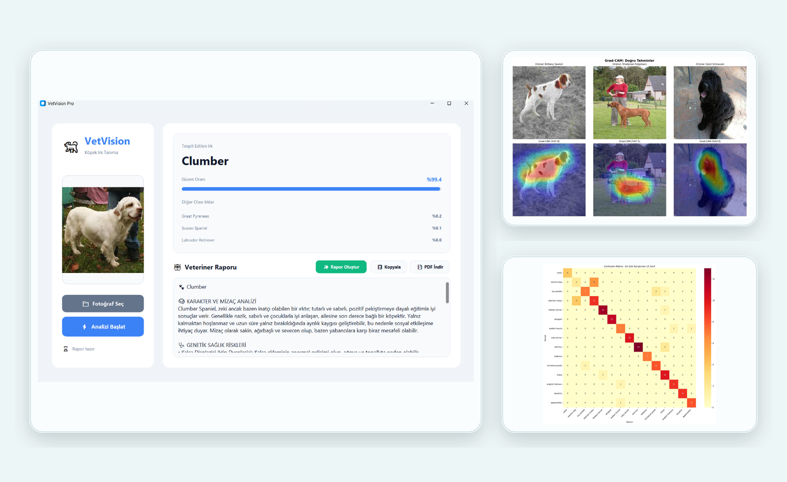
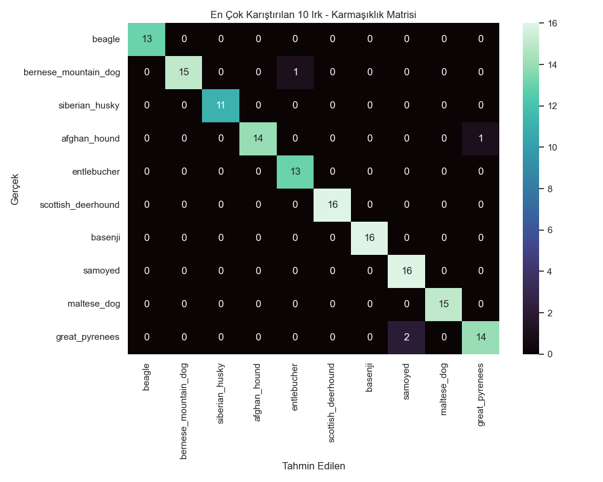

# VetVision

<p align="center">
  
</p>

<p align="center">
  
  
  
  
  
</p>

VetVision is a desktop AI assistant for dog breed recognition and breed-aware veterinary guidance. The public repository combines a `CustomTkinter` desktop application, an EfficientNet-based training script, local label assets, PDF export, and optional Gemini-powered report generation.

The opening visual above is assembled from the original report screens and evaluation artifacts so the repository leads with the real product surfaces.

## What the application does

- Loads a dog image from disk with file picker support and optional drag-and-drop
- Produces the top breed predictions from the trained model
- Shows the primary breed label and confidence score in the desktop UI
- Generates a veterinary-style text report with Gemini when an API key is available
- Exports the current result set as a PDF document
- Includes a training script for rebuilding the classification pipeline

## Repository reality

- The current desktop app uses a clean light `CustomTkinter` interface.
- The current training script is `EfficientNetB0`-based.
- Model, evaluation, and dataset artifacts are grouped under `artifacts/` so the source tree stays clearer without losing the original delivery assets.

## Academic context

- Course: `YBS 4015 Yapay Zeka`
- Project title: `VetVision: Yapay Zeka Destekli Köpek Irkı Analizi ve Veteriner Asistanı`
- Project window: `Oct 2025 - Dec 2025`
- Team: `Batuhan Yüksel`, `Yusuf Yılmaz`, `Savaş Avcı`, `Ekin Çelik`

## Tech stack

| Area | Tools |
| --- | --- |
| Desktop app | Python, CustomTkinter, Pillow |
| Inference | TensorFlow, NumPy |
| Report generation | Google Gemini API, ReportLab |
| Training | TensorFlow Keras, pandas, matplotlib |
| UX extras | tkinterdnd2 for drag-and-drop |
| Environment | python-dotenv |

## Repository structure

```text
.
|-- app.py
|-- train_model.py
|-- llm_test_api.py
|-- create_charts.py
|-- requirements.txt
|-- artifacts/
|   |-- model/
|   |   |-- vetvision_model.h5
|   |   `-- labels.txt
|   |-- dataset/
|   |   |-- labels.csv
|   |   `-- sample_submission.csv
|   `-- evaluation/
|       |-- confusion_matrix.png
|       `-- report.txt
`-- docs/assets/
```

## Running locally

1. Create a virtual environment:

   ```bash
   python3 -m venv .venv
   source .venv/bin/activate
   ```

2. Install the dependencies:

   ```bash
   pip install -r requirements.txt
   ```

3. Create an environment file if you want Gemini-backed report generation:

   ```bash
   cp .env.example .env
   ```

4. Add your Gemini key to `.env` if you want AI-generated veterinary summaries:

   ```bash
   GEMINI_API_KEY=your-key-here
   ```

5. Launch the desktop application:

   ```bash
   python app.py
   ```

If `GEMINI_API_KEY` is not set, the app still works for local breed recognition and PDF export, but the LLM-backed veterinary narrative remains disabled.

## Training pipeline

- `train_model.py` organizes the dataset into train and validation folders
- the current script uses transfer learning with `EfficientNetB0`
- augmentation is applied through `ImageDataGenerator`
- the best model is saved as `artifacts/model/vetvision_model.h5`

## Evaluation artifact

The repository already includes the confusion matrix generated during the academic delivery:

<p align="center">
  
</p>

## Notes on scope

- This repository is strongest as a course project handoff and desktop AI demo.
- The public snapshot still includes the original heavy model and evaluation artifacts, but they are grouped under `artifacts/` to reduce root-level clutter.
- A production packaging pass would normally move the trained model to a release asset or model registry instead of versioning it in the source tree.

## License

Released under the [MIT License](LICENSE).
